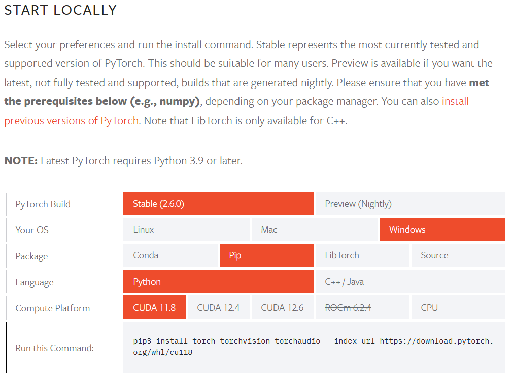

# Face Recognition in Python
This repository contains code that loads in the `CELEBA` dataset and trains a deep learning model to identiy the trained faces to a high accuracy. Furthermore after training the best model is validated. 

There is a main file that performs the key steps in a deep learning project. To run that file create a local clone of the repository and follow the instructions below.

## Requirements
Before running the main script you will need to install some dependencies. 

It is recommended you use a virtual environment like venv or conda. If you are using conda you can create a virtual env by pasting this command: `conda create -n env_name python=3.12`, python 3.12 is used and tested.

To install the dependencies you will need to use `pip` manager by simply pasting this command `pip install -r requirements.txt` however the PyTorch requirements varies by operating system thus you may need to edit the requirements file accordingly from <https://pytorch.org/get-started/locally/> 

To install the dependencies more quickly, run the two commands sequentially: `pip install uv` & `uv pip install -r requirements.txt`

